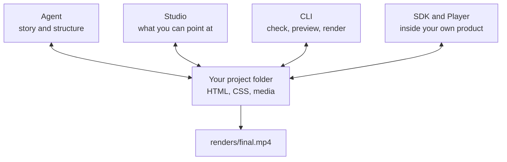
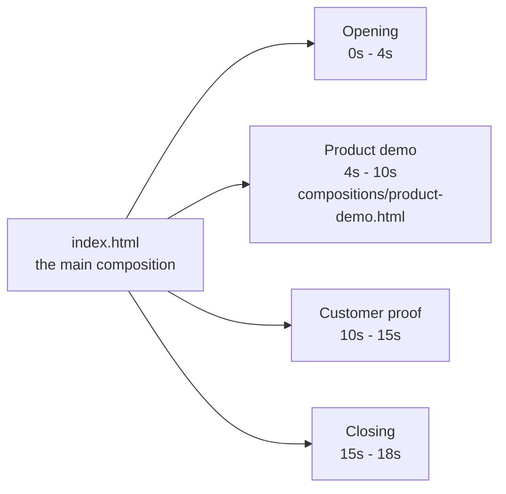

A HyperFrames project is a folder your agent can create and you can keep
editing. Its HTML is the video: it describes the scenes, timing, motion, media,
and reusable parts that HyperFrames plays or renders.

One folder of HTML is the whole video. Every tool below reads and writes those
same files — there is no export step between them and no second version of the
project.



## The source is the project

The agent, Studio, CLI, SDK, and Player do not create separate versions of the
video. They work with the same project files.

| What you want to change                              | Best place to start |
| ---------------------------------------------------- | ------------------- |
| Story, structure, or several scenes                  | Ask the agent       |
| Text, layout, timing, or animation you can see       | Studio              |
| Preview, checks, snapshots, rendering, or automation | CLI                 |
| A composition inside your own product                | SDK or Player       |

<div style={{ maxWidth: "42rem", margin: "1.5rem auto" }}>
  <Frame caption="The same editable project open in Studio, with its source, canvas, controls, and timeline.">
    
  </Frame>
</div>

Studio writes supported edits back into the source. An agent can continue from
those files, Git can track them, and the renderer sees the same result.

## What the agent creates

A larger project often looks like this:

```text
project/
├── BRIEF.md              what the video must communicate
├── STORYBOARD.md         the planned sequence and review state
├── SCRIPT.md             locked narration, when the video has it
├── frame.md              visual direction, when the project needs one
├── index.html            the main composition
├── hyperframes.json      project settings
├── compositions/         scenes and reusable visual parts
├── assets/               images, video, audio, and fonts
└── renders/              finished files
```

Only the project source is essential. Planning files exist to preserve decisions
across reviews and agent sessions. A simple title card may need only
`index.html` and an asset; a narrated launch film benefits from a brief,
storyboard, script, and separate scenes.

## Compositions hold the video together

A **composition** is a finite, seekable piece of the project. The main
composition is the complete sequence. Other compositions can be scenes,
captions, title systems, or visuals reused more than once.



Each part is still HTML. A larger project stays manageable because a scene can
be built and checked on its own, then placed on the main timeline.

```html
<div
  data-composition-id="product-demo"
  data-composition-src="compositions/product-demo.html"
  data-start="4"
  data-duration="6"
  data-track-index="1"
></div>
```

Edit the nested composition when the scene itself should change everywhere it
is used. Edit its placement in the main composition when only this appearance
should start earlier, run longer, or move to another layer.

## Time is part of the source

Timed elements carry their start, duration, and track in HTML:

```html

```

This image starts at two seconds, remains for three seconds, and appears on
track one. Animation timelines are paused and seekable, so Studio, the Player,
and the renderer can request an exact moment without playing from the
beginning.

## Variables keep approved parts changeable

A variable exposes something that is meant to change—such as a title, logo,
color, price, or customer name—without rebuilding the layout. One composition
can produce several approved versions while preserving its design and motion.

Use a variable when the structure should stay fixed. Use a normal edit when the
structure itself needs to change.

## How a project moves forward

There is no required seven-step ceremony. The project records only the
decisions its size and review process need.

| Decision                       | Where it usually lives                                      |
| ------------------------------ | ----------------------------------------------------------- |
| What the video is for          | Your request and, for a fuller project, `BRIEF.md`          |
| What happens and in what order | `STORYBOARD.md` and optional `SCRIPT.md`                    |
| How it looks                   | `frame.md`, project assets, and the compositions themselves |
| The editable result            | `index.html`, `compositions/`, and `assets/`                |
| The approved delivery          | checks plus the file in `renders/`                          |

Review the message and sequence before polishing individual frames. Once the
project looks right, run the checks, render it, and watch the exported file.

## Why rendering can repeat the same moment

HyperFrames seeks the composition to an exact time, captures the frame, and
advances. Media and audio follow the same timeline.

For the same source, media, and settings, an exact timestamp should resolve to
the same project state. Compositions therefore avoid the current clock,
unseeded randomness, and render-time network requests.

## Go deeper when you need it

<CardGroup cols={2}>
  <Card title="Reuse a design with variables" icon="sliders" href="/concepts/variables">
    Expose approved content without opening the layout.
  </Card>
  <Card title="Finish and share a video" icon="circle-check" href="/guides/export-and-share">
    Review, check, render, watch, and deliver the same project.
  </Card>
  <Card title="Composition structure" icon="layer-group" href="/concepts/compositions">
    Use nested compositions and exact source attributes.
  </Card>
  <Card title="HTML schema" icon="code" href="/reference/html-schema">
    Look up the complete technical composition contract.
  </Card>
</CardGroup>

## Related topics

- [Take more control of an existing project](/go-further)
- [Look up the complete HTML schema](/reference/html-schema)
- [Choose a developer integration surface](/developers/overview)
